# 使用CSS实现多种Noise噪点效果

> 声明：本文涉及图文和模型素材仅用于个人学习、研究和欣赏，请勿二次修改、非法传播、转载、出版、商用、及进行其他获利行为。

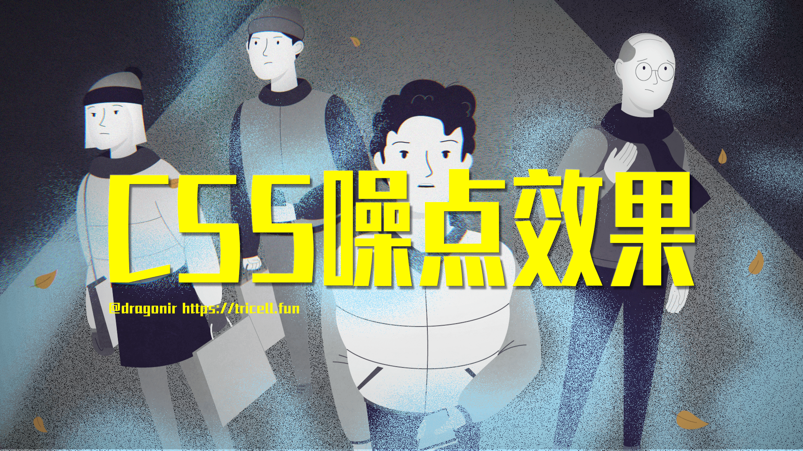

## 背景

在插画中添加噪点肌理可以营造出一种自然的氛围。噪点肌理可以用于塑造阴影、高光、深度以及更多细节，并优化插画质感，应用噪点肌理的方式在扁平插画中广受欢迎。在前端开发过程中，我们也有可能遇到噪点插画风格的设计稿，应用基础的前端开发知识，能不能实现噪点风格的样式呢，本文主要内容主要就是通过几个示例来实现几种噪点效果。本文包含的知识点包括：

开始本文主要内容之前，我们先来欣赏几张设计师在插画作品中应用噪点肌理的优秀例子。


> 作品链接 [dribbble.com](https://dribbble.com/shots/11606991-Delivery-Man/attachments/3228553?mode=media)

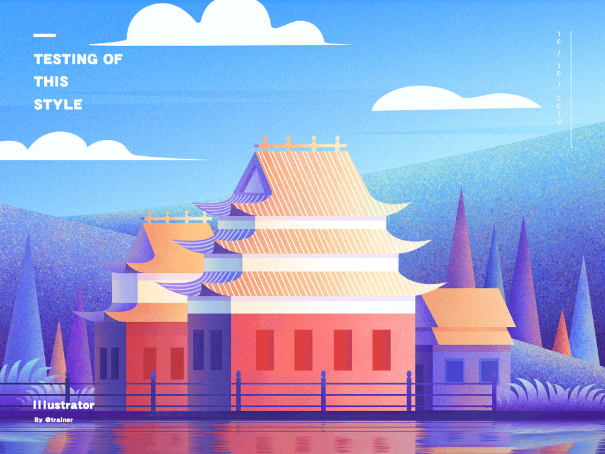

> 作品链接 [dribbble.com](https://dribbble.com/shots/5828000-Noise-Illustrator-Card)

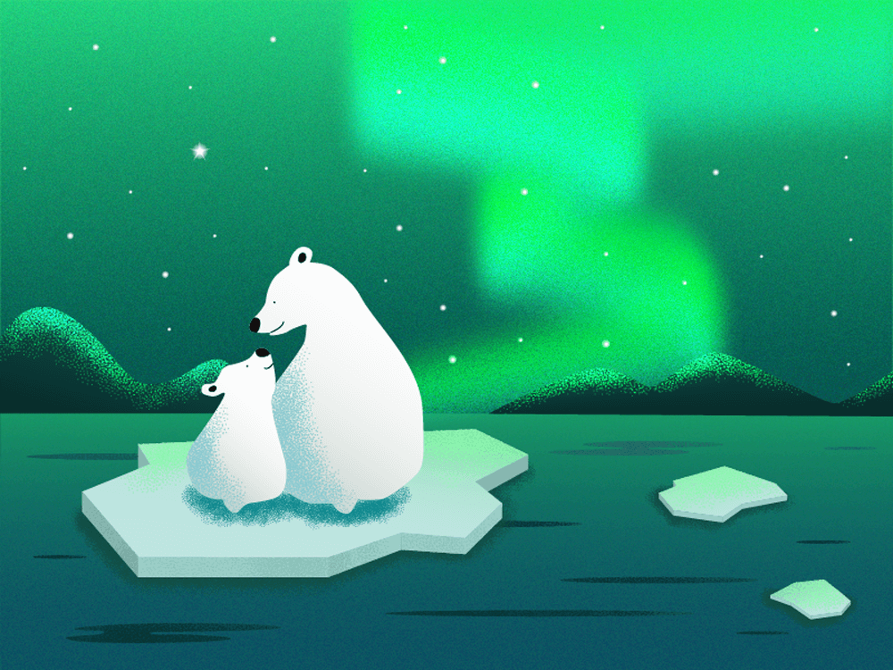

> 作品链接 [dribbble.com](https://dribbble.com/shots/14092887-Polar-bears)


## 知识汇总

### PS 实现

在 `Photoshop` 中增加噪点效果的基础操作方法：

* 混合模式（溶解）+ 柔和笔刷（做暗灰亮）
* 添加材质（正片叠底）
* 图层样式（内阴影，投影等）
* 噪点笔刷绘制

### 知识点

本文中将用到以下几个 `CSS` 特性，正式开发之前先简单了解下。

#### `💡` `mask`

`CSS` 属性 `mask` 允许使用者通过遮罩或者裁切特定区域的图片的方式来隐藏一个元素的部分或者全部可见区域。

**基本用法**：

```css
// 使用位图来做遮罩
mask: url(mask.png);
// 使用 SVG 图形中的形状来做遮罩
mask: url(masks.svg#star);
```

> `🔗` 详细用法可访问：[MDN](https://developer.mozilla.org/zh-CN/docs/Web/CSS/mask)

#### `💡` feTurbulence

在 `SVG` `中，feTurbulence` 滤镜利用 `Perlin` 噪声函数创建了一个图像。它实现了人造纹理比如说云纹、大理石纹的合成。本文中将利用该滤镜生成噪点背景图片。

> `🔗` 详细用法可访问：[MDN](https://developer.mozilla.org/zh-CN/docs/Web/SVG/Element/feTurbulence)

#### `💡` filter

`CSS` 属性 `filter` 将模糊或颜色偏移等图形效果应用于元素。可以为元素添加滤镜效果，本文中主要应用它来增强噪点视觉效果。

> `🔗` 详细用法可访问：[MDN](https://developer.mozilla.org/zh-CN/docs/Web/CSS/filter)，也可访问我的另外一篇文章[《CSS filter 有哪些神奇用途》](https://juejin.cn/post/6966036468619804679)，其中有 `filter` 应用的详细介绍。
#### `💡` mix-blend-mode

`CSS` 属性 `mix-blend-mode` 描述了元素的内容应该与元素的直系父元素的内容和元素的背景如何混合。

**基本语法**：

```css
mix-blend-mode: normal;
mix-blend-mode: multiply;
mix-blend-mode: screen;
mix-blend-mode: overlay;
mix-blend-mode: darken;
mix-blend-mode: lighten;
mix-blend-mode: color-dodge
mix-blend-mode: color-burn;
mix-blend-mode: hard-light;
mix-blend-mode: soft-light;
mix-blend-mode: difference;
mix-blend-mode: exclusion;
mix-blend-mode: hue;
mix-blend-mode: saturation;
mix-blend-mode: color;
mix-blend-mode: luminosity;
mix-blend-mode: initial;
mix-blend-mode: inherit;
mix-blend-mode: unset;
```

不同 `mix-blend-mode` 效果：

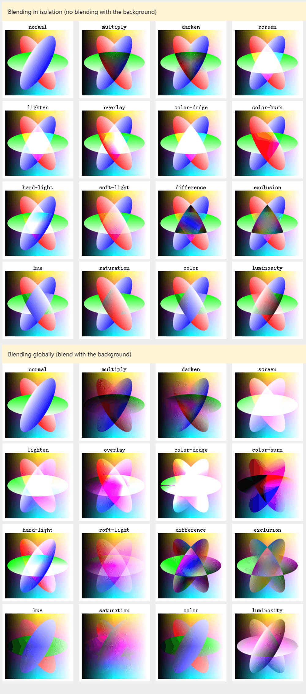

> `🔗` 详细用法可访问：[MDN](https://developer.mozilla.org/zh-CN/docs/Web/CSS/mix-blend-mode)

#### `💡` image-rendering

`CSS` 属性 `image-rendering` 用于设置图像缩放算法。它适用于元素本身，适用于元素其他属性中的图像，也应用于子元素。

**基本语法**：

```css
image-rendering: auto;
image-rendering: crisp-edges;
image-rendering: pixelated;
```

其中：

* `auto`：自动，自 `Gecko 1.9` 起，使用双线性算法进行重新采样。
* `crisp-edges`：必须使用可有效保留对比度和图像中的边缘的算法来对图像进行缩放，并且，该算法既不会平滑颜色，又不会在处理过程中为图像引入模糊。
* `pixelated`：放大图像时，使用最近邻居算法，因此，图像看着像是由大块像素组成的。缩小图像时，算法与 `auto` 相同。

> `🔗` 详细用法可访问：[MDN](https://developer.mozilla.org/zh-CN/docs/Web/CSS/image-rendering)

## 实现

* `👀` 在线预览: [https://codepen.io/dragonir/full/rNdrmzB](https://codepen.io/dragonir/full/rNdrmzB)
* `👀` 在线预览: 


定义 `CSS` 全局变量。

```css
:root {
  --black: #000000;
  --blue: #0072ff;
  --green: #03c03c;
  --yellow: #fffc00;
  --red: #ff4b2b;
  --orange: #f5af19;
  --pink: #ee9ca7;
  --purple: #a770ef;
}
```

创建一个 `SVG` 噪点背景，后续将使用创建的 `SVG` 元素作为其他元素的噪点背景。

```html
<svg viewBox="0 0 200 200" xmlns='http://www.w3.org/2000/svg'>
  <filter id='noise'>
    <feTurbulence type='fractalNoise' baseFrequency='0.65' numOctaves='3' stitchTiles='stitch' />
  </filter>
  <rect width='100%' height='100%' filter='url(#noiseFilter)' />
</svg>
```

### 类型0 🌚

通过给 `background` 添加 `linear-gradient` 和噪点图片背景，就可实现渐变的噪点效果。

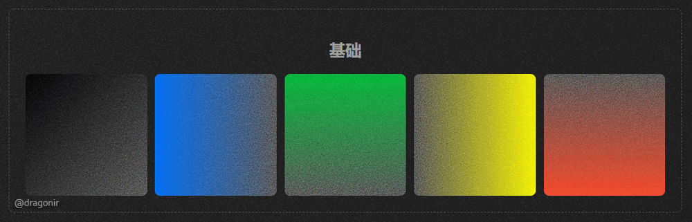

```html
<div class="noise_0"></div>
```

```css
.noise_0 {
  background: linear-gradient(to right bottom, var(--black), rgba(0, 0, 0, 0)), url(#noise);
}
```

### 类型1 🌑

在上面的基础上，通过修改 `filter` 属性的对比度 `contrast` 和亮度 `brightness`，增强噪点效果得对比度。

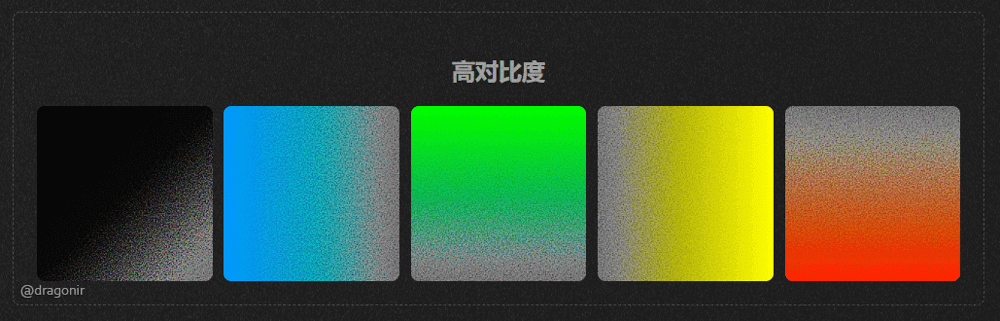

```html
<div class="noise_1"></div>
```

```css
.noise_1 {
  filter: contrast(200%) brightness(150%);
}
```

### 类型2 🌒

使用 `mix-blend-mode: multiply` 实现混合双色渐变的噪点效果。

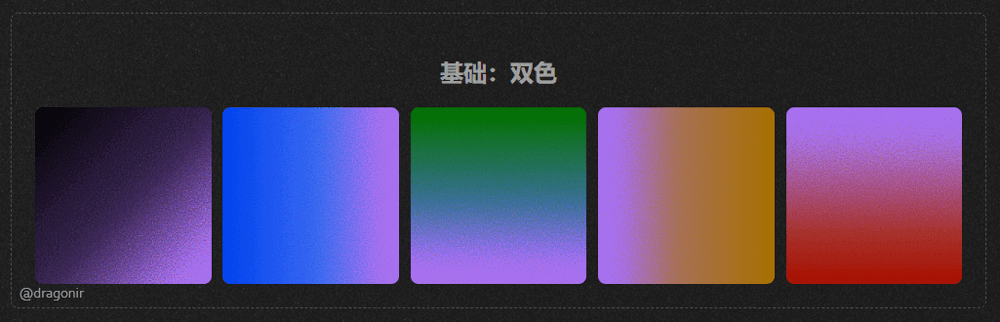

```html
<div class="noise noise_2">
  <div class="isolate">
    <div class="gradient"></div>
    <div class="overlay"></div>
  </div>
</div>
```

```css
.noise_2 {
  position: relative;
}
.noise_2 .isolate {
  isolation: isolate;
  position: relative;
  width: 100%;
  height: 100%;
}
.noise_2 .overlay {
  position: absolute;
  top: 0;
  width: 100%;
  height: 100%;
  background: var(--purple);
  mix-blend-mode: multiply;
}
.noise_2 .gradient {
  height: 100%;
  width: 100%;
  filter: contrast(200%) brightness(150%);
  background: linear-gradient(to right bottom, var(--black), rgba(0, 0, 0, 0)), url(#noise);
}
```

### 类型3 🌓

圆形的噪点元素。

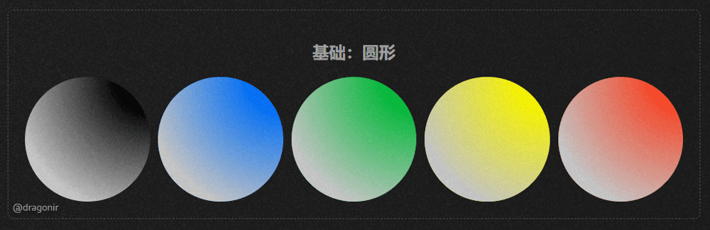

```html
<div class="noise_3">
  <div class="gradient"></div>
</div>
```

```css
.noise_3 {
  border-radius: 50%;
}
.noise_3 {
  background: var(--black);
}
.noise_3 .gradient {
  width: 100%;
  height: 100%;
  background: radial-gradient(circle at 100% 0, transparent 20%, #cccccc 80%);
  mask: url(#noise), radial-gradient(circle at 100% 0, transparent 10%, #000 60%);
}
```

### 类型4 🌔

球形的噪点元素，给圆形噪点添加地面阴影和光照效果就能形成立体的球体效果。

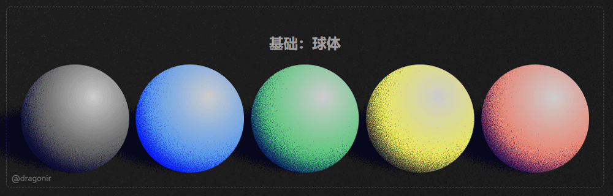

```html
<div class="noise noise_5">
  <div class="ground"><div class="ground-shadow"></div></div>
  <div class="ball">
    <div class="isolate">
      <div class="ball-shadow"></div>
      <div class="ball-light"></div>
    </div>
  </div>
</div>
```

```html
<style>
.noise_5 {
  position: relative;
}
.noise_5 .ball {
  position: relative;
  display: flex;
  align-items: center;
  justify-content: center;
  height: 100%;
  width: 100%;
  border-radius: 50%;
  overflow: hidden;
  z-index: 20;
}
.noise_5 .isolate {
  isolation: isolate;
  position: absolute;
  top: 0;
  height: 100%;
  width: 100%;
}
.noise_5 .ball-shadow {
  height: 100%;
  background: radial-gradient(circle at 65% 35%, rgba(0, 0, 0, 0), mediumblue), url(#noise);
  filter: contrast(120%) brightness(900%);
}
.noise_5 .ground {
  position: absolute;
  width: 150%;
  height: 140px;
  bottom: -10px;
  left: -65%;
  transform: rotateZ(7deg);
  mix-blend-mode: multiply;
}
.noise_5 .ground-shadow {
  width: 95%;
  height: 140px;
  border-radius: 50%;
  background: radial-gradient(ellipse at 70%, navy, rgba(0, 0, 0, 0)), url(#noise);
  filter: contrast(150%) brightness(700%);
}
.noise_5 .ball-light {
  position: absolute;
  top: 0;
  width: 100%;
  height: 100%;
  mix-blend-mode: multiply;
  background: radial-gradient(circle at 67% 30%, #ccc, var(--black));
}
</style>
```

### 类型5 🌕

其他 `3D` 立体形状，包括球体、布丁 `🍮`、水滴 `💧`、花瓶 `🏺`、鸡蛋 `🥚`、红细胞 `💉`等，`🖱` 鼠标悬浮到元素上面可以看到三维旋转效果。

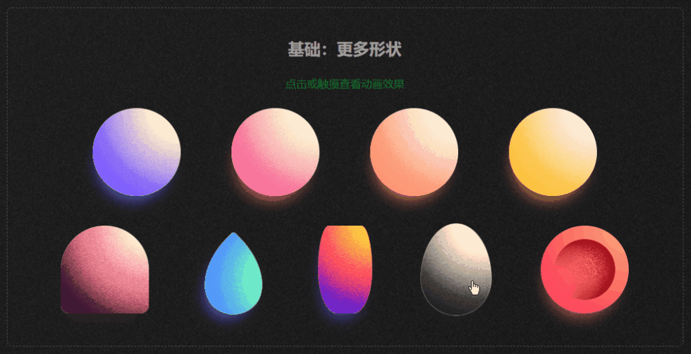

```html
<div class="item item--sphere item--color1"></div>
<div class="item item--pudding item--color5"></div>
<div class="item item--droplet item--color6"></div>
<div class="item item--vase item--color7"></div>
<div class="item item--egg item--color8"></div>
<div class="item item--cell"></div>
```

```css
.item {
  background-color: #ffecd2;
  box-shadow: -5px 18px 25px -15px;
  overflow: hidden;
  transition: all 0.2s ease-out;
  image-rendering: pixelated;
}
.item::before {
  content: "";
  position: absolute;
  display: block;
  top: 0;
  left: 0;
  height: 100%;
  width: 400%;
  mask: url(#noise), radial-gradient(circle at 50% 0, transparent 5%, #000 80%) 0 0/50% 100%;
}
.item:hover {
  transform: scale(1.05);
}
.item:hover.item::before, .item:hover.item::after {
  animation: spin-round 3.5s linear infinite;
}
.item:active {
  animation: hue-rotate 7s infinite;
}
.item--sphere {
  border-radius: 50%;
}
.item--egg {
  width: 100.1px;
  border-radius: 50% 50% 50% 50%/60% 60% 40% 40%;
}
.item--pudding {
  width: 130px;
  height: 130px;
  border-radius: 50% 50% 10% 10%;
}
.item--pudding::after {
  content: "";
  position: absolute;
  top: 0;
  display: block;
  top: 0;
  left: 0;
  height: 100%;
  width: 400%;
  mask: url(#noise), radial-gradient(circle at 50% 0, transparent 55%, #000 85%) 0 0/50% 100%;
}
.item--droplet {
  width: 100.1px;
  height: 100.1px;
  border-radius: 5% 100% 50% 65%/5% 65% 50% 100%;
  transform: rotate(45deg);
  box-shadow: 5px 18px 25px -15px;
}
.item--droplet:hover {
  transform: rotate(45deg) scale(1.05);
}
.item--vase {
  position: relative;
  width: 80px;
  height: 130px;
  border-radius: 40% 40% 70% 70%/100%;
}
.item--vase::after {
  content: "";
  position: absolute;
  top: 0;
  display: block;
  top: 0;
  left: 0;
  height: 100%;
  width: 400%;
  mask: url(#noise), radial-gradient(circle at 50% 0, transparent 55%, #000 90%) 0 0/50% 100%;
}
.item--cell {
  width: 130px;
  height: 130px;
  border-radius: 50%;
  color: #ff4d5d;
  background: radial-gradient(circle at 100% 0, #ffa878 5%, transparent 75%), #ff4d5d;
}
.item--cell::before {
  top: 50%;
  left: 50%;
  transform: translate(-50%, -50%);
  width: 90px;
  height: 90px;
  border-radius: 50%;
  background: radial-gradient(circle at 0 75%, transparent 20%, #98000e 65%);
  mask: url(#noise), radial-gradient(circle at 50%, transparent 25%, #000 75%);
}
.item--cell:hover {
  animation: spin-flat-thick 3.5s linear infinite;
}
.item--cell:hover.item--cell::before {
  animation: spin-flat 3.5s linear infinite;
}
.item--cell:hover:active {
  animation: spin-flat-thick 3.5s linear infinite, hue-rotate 7s linear infinite;
}
.item--color1 {
  color: #7f5fff;
}
.item--color1::before {
  background: repeat-x 100% 0/50% 100% radial-gradient(circle at 50% 0, transparent 25%, #7f5fff 65%);
}
.item--color5 {
  color: #3d1635;
  background-color: #ffecd2;
}
.item--color5::before {
  background: repeat-x 100% 0/50% 100% radial-gradient(circle at 50% 0, transparent 15%, #e7627d 45%);
}
.item--color5::after {
  background: repeat-x 100% 0/50% 100% radial-gradient(circle at 50% 0, transparent 50%, #3d1635 75%);
}
.item--color6 {
  background-color: #72f9c1;
  color: #5193ff;
}
.item--color6::before {
  background: repeat-x 100% 0/50% 100% radial-gradient(circle at 50% 0, transparent 25%, #5193ff 65%);
}
.item--color7 {
  color: #5e21d6;
  background-color: #fec440;
}
.item--color7::before {
  background: repeat-x 100% 0/50% 100% radial-gradient(circle at 50% 0, transparent 15%, #fd2472 45%);
}
.item--color7::after {
  background: repeat-x 100% 0/50% 100% radial-gradient(circle at 50% 0, transparent 50%, #5e21d6 75%);
}
.item--color8 {
  color: #222;
}
.item--color8::before {
  background: repeat-x 100% 0/50% 100% radial-gradient(circle at 50% 0, transparent 25%, #222 65%);
}
```

### 类型6 🌝

多个噪点元素地叠加可以生成非常惊艳的效果，比如通过将三个噪点元素层叠在一起可以实现光学三原色 `RGB` 效果。

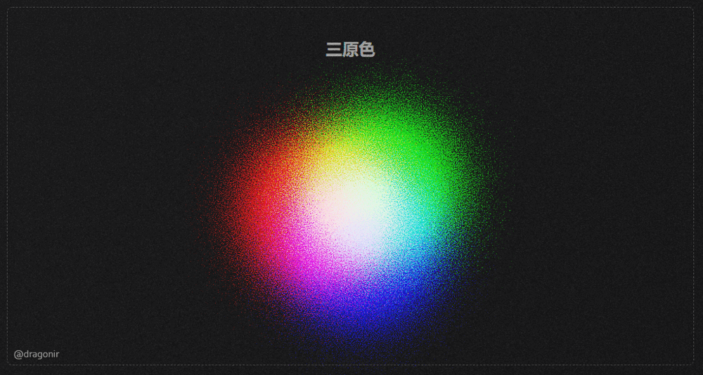

```html
<div class="noise_6">
  <div class="circle noise-1"></div>
  <div class="circle noise-2"></div>
  <div class="circle noise-3"></div>
</div>
```

```css
.noise_6 .circle {
  filter: contrast(145%) brightness(650%) invert(100%);
  mix-blend-mode: screen;
}
.noise_6 .noise-1 {
  position: absolute;
  top: 0;
  left: -10%;
  background: radial-gradient(circle at 50% 50%, rgba(0,255,255,1), rgba(0,0,0,0)), url(#noise);
}
.noise_6 .noise-2 {
  position: absolute;
  left: 10%;
  top: -30px;
  background: radial-gradient(circle at 50% 50%, rgba(255,0,255,1), rgba(0,0,0,0)), url(#noise);
}
.noise_6 .noise-3 {
  position: absolute;
  top: 50px;
  left: 4%;
  background: radial-gradient(circle at 50% 50%, rgba(255,255,0,1), rgba(0,0,0,0)), url(#noise);
}
```

### 类型7 🌙

利用噪点元素还可以实现什么呢？中心扩散效果，太阳，涟漪，荷包蛋……

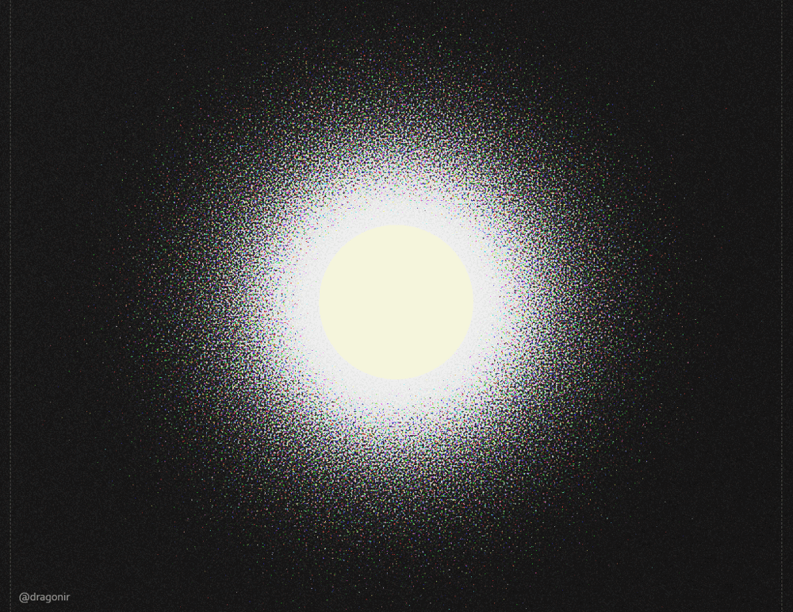

```html
<div class="noise_7">
  <div class="noise"></div>
  <div class="center">
    <div class="circle">
    </div>
  </div>
</div>
```

```html
<style>
.noise_7 {
  position: relative;
  width: 1000px;
  height: 1000px;
  margin: 0 auto;
}
.noise_7 .noise {
  width: 100%;
  height: 100%;
  background: radial-gradient(circle at 50% 50%, rgba(0, 0, 0, 1), rgba(0, 0, 0, 0)), url(#noise);
  filter: contrast(145%) brightness(650%) invert(100%);
  mix-blend-mode: screen;
}
.noise_7 .center {
  position: absolute;
  top: 0;
  width: 100%;
  height: 100%;
  display: flex;
  justify-content: center;
  align-items: center;
}
.noise_7 .circle {
  width: 200px;
  height: 200px;
  background-color: beige;
  border-radius: 50%;
}
</style>
```

### 背景噪点 🌜

如果仔细观察的话，页面黑色背景也应用了噪点效果，是不是有一种黑白电视机的雪花屏复古感 `😂`。

```html
<div class="bg"></div>
```

```css
.bg {
  position: fixed;
  top: -50%;
  left: -50%;
  right: -50%;
  bottom: -50%;
  width: 200%;
  height: 200vh;
  background: transparent url(#noise) repeat 0 0;
  background-repeat: repeat;
  animation: bg-animation .2s infinite;
  opacity: .9;
  visibility: visible;
}
@keyframes bg-animation {
  0% { transform: translate(0,0) }
  10% { transform: translate(-5%,-5%) }
  20% { transform: translate(-10%,5%) }
  30% { transform: translate(5%,-10%) }
  40% { transform: translate(-5%,15%) }
  50% { transform: translate(-10%,5%) }
  60% { transform: translate(15%,0) }
  70% { transform: translate(0,10%) }
  80% { transform: translate(-15%,0) }
  90% { transform: translate(10%,5%) }
  100% { transform: translate(5%,0) }
}
```

> `📥` 完整代码：

## 总结

本文主要包含的知识点包括：

* `CSS` 属性 `mask` 遮罩
* `SVG` 滤镜 `feTurbulence`
* `CSS` 属性 `filter` 滤镜
* `CSS` 属性 `mix-blend-mode` 元素混合
* `CSS` 属性 `image-rendering` 图像缩放

> 想了解其他前端知识或 `WEB 3D` 开发技术相关知识，可阅读我往期文章。**转载请注明原文地址和作者**。如果觉得文章对你有帮助，不要忘了**一键三连哦 👍**。

## 附录

* [1]. [📷 前端实现很哇塞的浏览器端扫码功能](https://juejin.cn/post/7018722520345870350)
* [2]. [🌏 前端瓦片地图加载之塞尔达传说旷野之息](https://juejin.cn/post/7007432493569671182)
* [3]. [🆒 仅用CSS几步实现赛博朋克2077风格视觉效果](https://juejin.cn/post/6972759988632551460)
* `...`

[3D](https://juejin.cn/column/7049923956257587213)

* [1]. [🦊 Three.js 实现3D开放世界小游戏：阿狸的多元宇宙](https://juejin.cn/post/7081429595689320478)
* [2]. [🔥 Three.js 火焰效果实现艾尔登法环动态logo](https://juejin.cn/post/7077726955528781832)
* [3]. [🐼 Three.js 实现2022冬奥主题3D趣味页面，含冰墩墩](https://juejin.cn/post/7060292943608807460)
* `...`

## 参考

* <https://codepen.io/cjimmy/pens/public?cursor=ZD0xJm89MCZwPTEmdj01NDUyNTE0OA==>
* <https://codepen.io/DavidJAldred/details/pVbQBJ>
* <https://dribbble.com/shots/17920431-Personalities>
